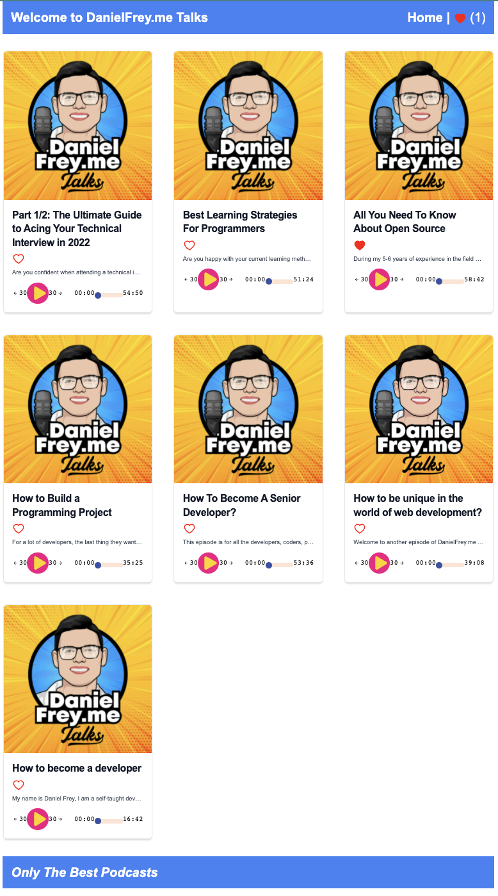
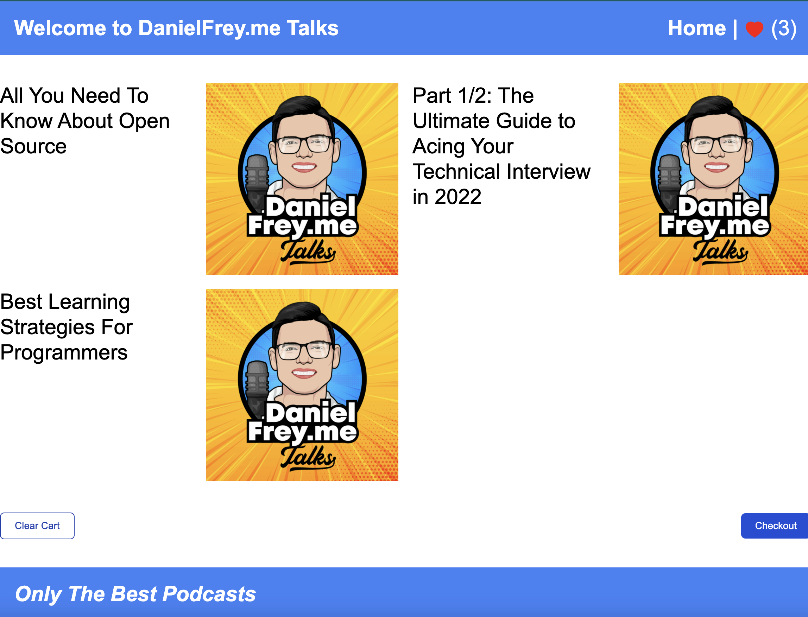
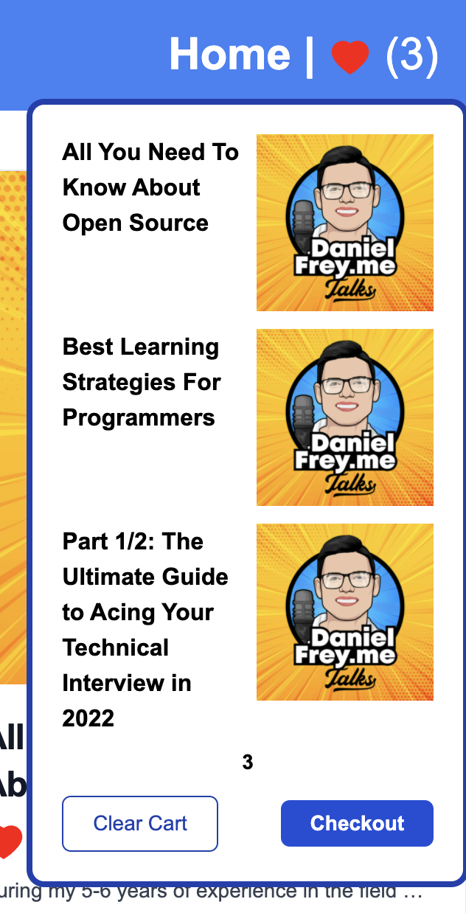

# MicroFes 🔀🚀

This project is built on top of [Module Federation](https://webpack.js.org/concepts/module-federation/), which allows to separate builds to form a single application. These separate builds should not have dependencies between each other, so they can be developed and deployed individually.

This repo is part of my Micro Frontends talk.

#### Getting started
Navigate to the repository's root directory and run the following commands:
```
yarn
yarn start
```
- The application is now running at [http://localhost:8080](http://localhost:8080)
- In parallel few other projects are running as well. they are all conntected to the same "host" application, which is located at the folder packages/Home.

### Demo images




